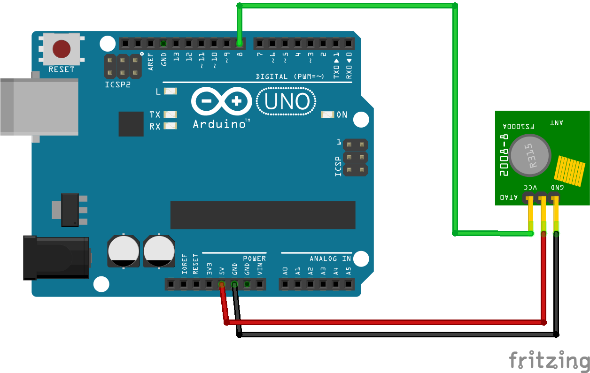

# Nexa-433mhz-Transmitter-Decoding
Code for transmission of Nexa 433Mhz signals with arduino and basic hardwear. Instructions for decoding Nexa 433MHZ with SDR dongel and basic software. 
The Nexa model used was PET-910, date code: 1910. However you can use this guide to decode and transmitt *other* 433Mhz remotes/tools.

Hardware:
1. [USB-SDR dongel](https://www.aliexpress.com/item/1005003302259707.html?spm=a2g0o.productlist.main.3.3997n3JUn3JUGd&algo_pvid=1b862a87-4f75-4de8-b492-783b76a47d51&algo_exp_id=1b862a87-4f75-4de8-b492-783b76a47d51-1&pdp_npi=4%40dis%21SEK%21176.37%2167.57%21%21%2116.21%216.21%21%40211b600917115310352167016e67ee%2112000025100668860%21sea%21SE%212861552960%21AB&curPageLogUid=JUBpMHMqx3fD&utparam-url=scene%3Asearch%7Cquery_from%3A)
2. Arduino Uno or other
3. DuPont wires
4. 433Mhz Transmitter [(FS1000A used)](https://www.aliexpress.com/w/wholesale-fs1000A.html?spm=a2g0o.productlist.search.0)

Software:
1. Code edtior
2. [Audacity](https://www.audacityteam.org/)
3. [SDR Sharp](https://airspy.com/download/)

## Decoding
Recording the signal is done with a cheap SDR-dongel and a free sdr software such as SDRSharp. I recommend looking at some youtubevideos how to navigate the SDR software, it is easy and intuative but its easy to get lost in all the options and buttons!

After connecting the sdr to your computer you want to make recordings for each button press, both for on and off. *Remeber to give these recordings clear names! ie - button1_on, button1_off* 

These recordings can then later be opened in Audacity for decoding picture and measurments.

What you will se in Audacity will be similar to this.

The signal is composed of 4 parts.
1. paring/start
2. controller ID
3. on/off
4. group

Lets break it down. As you can se the signal almost looks identical and that is true. Also these remotes are often structured in a similar way so even if you don't have a nexa-910 this probabably still applies.

First part of the signal is the paring, there is alot of noise around 433Mhz and the reciver (Wallsocket in my case) is waiting for this part to be recived before listning for something else. Therefore if you send the controller id + on/off + group without the paring nothing will happen.

Second is the controller ID this is your remotes signature and allows more nexa reciver and transmitter to work in the same vicinity.

Third is the on or off.

Fourth is the group and this is which button you pressed.

As you can see the changing variable in the signal is the on/off and group while the controller id and paring stays constant. Knowing this it is easy for you to compare your signals and pick out what changes between button presses. When you have decoded your signal there is still one vital part missing to transmitt, the timing/pulselength. 

The space between the highs and the lows are integral for the reciver to understand the signal that is sent. Luckily Audacity has a measuring function, therefore we can measure the time for the paring and pulselength.
In my case the paring was 3000 microseconds and pulselength was 275 microseconds.

Insert all these variables into the attached code and you are now able to transmitt and controll your 433Mhz devices!

### Wireing

